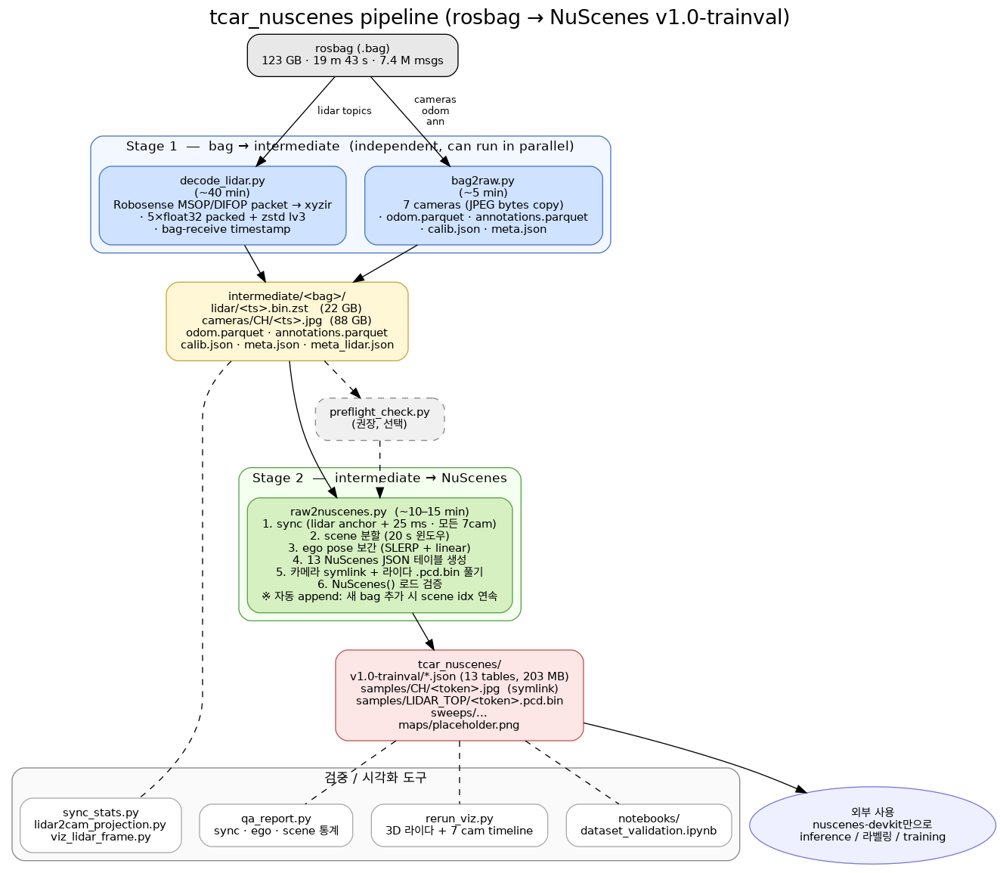

# tcar_nuscenes 파이프라인 개요

ROS1 rosbag → NuScenes v1.0-trainval 변환 파이프라인.

---

## 1. 처리 시간 (1 bag 기준)

**테스트 bag**: `traffic_260323_1.bag`
- 크기: 123 GB
- 길이: **19분 43초** (1,183.36 s)
- 메시지: 7,400,214 (lidar packets 7.1 M, cameras 240 k, odom 59 k, etc.)

| Stage | 시간 | CPU | 디스크 출력 |
|-------|-----|-----|-----------|
| **`decode_lidar.py`** | **~40 분** | 1 core (~50%) | 22 GB (lidar zstd) |
| **`bag2raw.py`** | **~5 분** | 1 core (I/O bound) | 88 GB (camera JPEG copy) + 9 MB meta |
| **`raw2nuscenes.py`** | **~10–15 분** | 1 core (I/O 위주) | 50 GB (lidar 압축 풀기) + 203 MB JSON + hardlink |
| **합계 (sequential)** | **~55–60 분** | | ~160 GB (intermediate + nuscenes) |
| **합계 (병렬)** | **~40 분** | 2 core | decode_lidar 와 bag2raw 동시 실행 가능 |

### Re-run 비용 (intermediate 존재 시)

stage 분리되어 있어서 **부분만 다시 돌리면 됨**:

| 시나리오 | 다시 돌릴 stage | 시간 |
|---------|----------------|------|
| 카메라 매핑 / 토픽 변경 | `bag2raw.py` | ~5 분 |
| Sync tolerance / scene 길이 / output 경로 변경 | `raw2nuscenes.py` | ~10–15 분 |
| 라이다 디코더 변경 | `decode_lidar.py` | ~40 분 |
| 두 번째 bag 추가 (append) | `raw2nuscenes.py` (자동 append) | ~10–15 분 |

### 주요 병목

- **`decode_lidar.py`**: 7.1 M packets × 384 points each = 27 억 inner loop. 순수 Python이라 가장 느림. numpy 벡터화하면 ~10 분으로 단축 가능 (현재 미구현, 일회성이라 유보).
- **`raw2nuscenes.py`**: lidar 11k frames `.bin.zst` → `.pcd.bin` decompress + 232k 카메라 JPEG hardlink. zstd decompress는 빠르지만 작은 파일 다수 I/O가 cost.

---

## 2. 전체 구조



### 부수 도구

| 스크립트 | 역할 |
|---------|------|
| `scripts/preflight_check.py` | stage-2 돌리기 전 intermediate 무결성 체크 |
| `scripts/qa_report.py` | dataset 자동 QA 리포트 (5 섹션) |
| `scripts/sync_stats.py` | sync tolerance 별 acceptance 통계 |
| `scripts/lidar2cam_projection.py` | calib 컨벤션 검증용 단일 frame 투영 viz |
| `scripts/extract_cam_viz.py` | bag 중간 시점 7 카메라 1장씩 추출 (매핑 검증) |
| `scripts/viz_lidar_frame.py` | 라이다 1 frame BEV+측면 viz |
| `scripts/rerun_viz.py` | rerun.io로 멀티모달 + 카메라 라이다 색칠 |

---

## 3. 시스템 설계 특징

### A. 단계 분리 + 캐시 친화적

bag 한 번 받으면 **무거운 작업은 한 번만** 돌림. 라이다 디코딩은 40분짜리 독립 단계라 한 번 끝나면 캐시. 이후 sync 정책, 카메라 매핑, scene 길이 같은 stage-2 파라미터를 바꾸려면 **10–15분짜리 raw2nuscenes만 다시** 돌리면 됨. 개발 사이클이 짧아짐.

### B. ROS 런타임 의존성 0

`rosbags` (PyPI 라이브러리)로 .bag 파일을 직접 파싱해서, **ROS Noetic 설치 / catkin 빌드 / roscore 띄우기** 모두 불필요. conda env 하나로 어느 머신에서나 실행 가능. 특히 도커 컨테이너 / CI / 개인 노트북 등으로 손쉽게 옮김.

### B-1. Robosense LiDAR 패킷 디코더 내장

bag에 PointCloud2가 아닌 raw `RslidarPacket`만 있어도 직접 디코딩. RSP128 (Ruby 128ch) 디코더가 순수 Python이라 외부 SDK 불필요. RSM1, RSBP 디코더도 패키지화되어 있어 다른 라이다 모델로 확장 쉬움.

### C. 시간 동기화의 명시적 통계 기반 결정

- 25 ms tolerance, 양방향 nearest neighbor → 7 채널 모두 통과해야 keyframe 인정.
- 통계 기반: `sync_stats.py`로 각 채널 p50/p99 + 채널별 acceptance % + tolerance별 keep ratio 출력. 이걸 보고 25 ms 결정 (software-synced 표준 ≤50 ms 안에서 빡센 편).
- 결과 dataset에서도 sync 검증 자동: `qa_report.py`가 scene별 keyframe 생존율, 채널별 long gap, ego pose 이상치를 점검.

### D. nuscenes-devkit 호환 보장

`raw2nuscenes.py` 마지막 단계에서 `NuScenes(version, dataroot, verbose=False)`로 직접 로드 → 한 줄로 schema 검증. 13 JSON 테이블, 토큰 외래키, sample_data prev/next 체인, ego_pose 참조까지 모두 확인. 통과해야 production-ready로 간주.

부수: `notebooks/dataset_validation.ipynb`로 `render_sample`, `render_pointcloud_in_image` 등 표준 API들이 우리 dataset에서 그대로 동작함을 확인.

### E. 캘리브레이션 컨벤션 자동 변환

원본 calib 파일은 OpenCV 외참 컨벤션 (P_cam = R · P_ego + t). NuScenes 표준은 sensor pose IN ego frame (R_ego_cam, t_ego_cam). raw2nuscenes 안에서 **자동 변환**. 캘리브 파일 형식 그대로 사용 가능.

### F. 멀티 bag (인크리멘털 데이터셋) 지원

새 bag 받으면 동일한 3-step 돌리기만 하면 됨. raw2nuscenes가 기존 dataset 자동 감지해서:
- scene 인덱스 연속 (`scene-0059`, `scene-0060`, …)
- 토큰 안정 (sensor / category / attribute / visibility 재사용)
- log 추가 (per-bag log record)
- 같은 bag 중복 import 시도하면 거부

### G. 7번째 카메라 (`CAM_TRAFFIC`) 지원

표준 6 카메라 외에 traffic light/sign 전용 카메라를 7번째 채널로 등록. nuscenes-devkit이 임의 채널 수를 받기 때문에, 표준 inference / eval 파이프라인은 6 채널만 쓰면 자동 무시. 트래픽 task는 7번째 채널까지 활용 가능.

### H. 풍부한 시각화

- **Jupyter notebook** (`dataset_validation.ipynb`): sync histogram, ego trajectory, 표준 devkit 렌더, scene mp4 inline
- **rerun.io 통합** (`rerun_viz.py`): 3D 라이다 + 7 카메라 + ego transform이 한 timeline에. 라이다를 카메라 픽셀 색으로 칠하는 토글 (lidar에 cam projection)
- **단일 frame 검증 도구**: `lidar2cam_projection.py`로 calib 컨벤션 confirmable, `viz_lidar_frame.py`로 BEV / side view

### I. 디스크 절약

- 카메라 JPEG: stage-2에서 intermediate와 inode를 공유하는 **hardlink** (디스크 추가 0)
- 라이다는 nuscenes 표준이 raw `.pcd.bin` 요구라서 decompress 필요 (≈ 50 GB)
- 결과: bag 123 GB → intermediate 125 GB + nuscenes 50 GB (실제 데이터, 메타 제외)

### J. 자동 무결성 검증

- **stage-2 시작 전**: `preflight_check.py`로 intermediate 일관성 점검 (frame 수 vs meta, calib 완전성, odom 연속성, lidar coverage)
- **stage-2 종료 시**: `NuScenes()` 로드 통과
- **dataset 통계 자동**: `qa_report.py`로 scene별 keep%, ego anomaly, lidar point 분포 1줄 요약

---

## 4. 왜 2-stage인가? (decode 제외, `bag2raw` ↔ `raw2nuscenes` 분리)

`decode_lidar`는 무거운 1회성 작업이라 분리는 자명. 여기선 **`bag2raw`(intermediate dump)** 와 **`raw2nuscenes`(NuScenes 변환)** 를 굳이 두 단계로 나눈 이유.

### 1-stage 가정 (만약 합쳤다면)

```
bag → [parse + sync + scene split + JSON 생성 + 파일 출력]  → NuScenes
```
한 스크립트로 끝. 단순.

### 2-stage 분리 이유

#### (1) Stage-2 파라미터를 자주 바꿈

stage-2에는 결정해야 할 파라미터가 많음:
- sync tolerance (25 ms / 30 / 40 / 50)
- keyframe rate (2 Hz / 10 Hz)
- scene 길이 (20 s / 다른 길이 / gap-based)
- 7→6 카메라 매핑 (CAM_TRAFFIC 포함 여부)
- output 경로 (다른 데이터셋 만들기)
- append vs fresh

이 중 하나만 바꿔도 1-stage면 **bag 재파싱 5분 + 라이다 캐시 활용 + 처리 = 매번 15–20분**. 2-stage면 **stage-2만 10–15분** (intermediate 캐시).

#### (2) Stage-2가 ROS/bag 지식 0

`raw2nuscenes`는 **순수 numpy + parquet + JSON**. rosbags 라이브러리 import 없음. 즉:
- ROS 한 줄도 없는 코드를 가지고 sync/scene 로직 알고리즘 개발 가능
- 파라미터 튜닝 코드를 다른 ML/eval 코드와 같은 환경에서 사용 가능
- bag 형식 변경에 영향받지 않음 (intermediate 형식만 안정적이면 OK)

#### (3) 동일 intermediate → 여러 NuScenes 변형

같은 intermediate에서 **다른 설정으로 여러 출력** 가능:
```
intermediate/<bag>/  ──┬──>  /data/tcar_nuscenes_strict/   (sync 25 ms)
                       ├──>  /data/tcar_nuscenes_lenient/  (sync 50 ms)
                       └──>  /data/tcar_nuscenes_5hz/      (keyframe 5 Hz, scene 10 s)
```
실험 비교 ("strict / lenient 중 어느 쪽이 라벨링 효율 좋은지") 같은 게 자연스러움.

#### (4) 디버깅 / 검증 분리

intermediate는 **스스로 검증 가능한 표준 포맷**:
- `cameras/CH/<ts>.jpg` ← 그냥 이미지로 열림
- `lidar/<ts>.bin.zst` ← decompress 후 numpy로 reshape
- `*.parquet` ← Pandas / DuckDB / pyarrow로 직접 query

문제 생기면:
- intermediate 자체가 이상 → bag 파싱 / 라이다 디코드 쪽 (`preflight_check.py`)
- intermediate 정상이고 NuScenes 출력만 이상 → sync / scene / JSON 로직 쪽

→ **에러 위치 빠르게 격리.** 1-stage라면 어디서 잘못됐는지 다 뒤져야 함.

#### (5) 부분 재실행 = 부분 다운타임

bag 추가될 때마다:
- `decode_lidar.py` (이전 bag 결과는 그대로) → 새 bag만 40 분
- `bag2raw.py` (이전 bag 결과는 그대로) → 새 bag만 5 분
- `raw2nuscenes.py` (자동 append 모드) → 10–15 분

기존 dataset에 영향 0. 1-stage라면 "기존 nuscenes에 새 bag 합치기"가 더 복잡.

#### (6) 실패 시 재시작 비용

stage-2가 도중에 실패 (예: 디스크 부족, 코드 버그)해도 **intermediate는 멀쩡**. stage-2만 다시 돌리면 됨. 1-stage였으면 bag 재파싱부터 시작.

### 2-stage 단점 (정직하게)

1. **디스크 사용 ~2x**: intermediate (125 GB) + nuscenes (50 GB) 동시에 존재. 카메라는 hardlink라 intermediate를 지워도 데이터셋은 멀쩡하고, 회수되는 건 lidar `.bin.zst` 뿐이다.
2. **스크립트 2개**: 한 번에 끝나는 1-stage 대비 명령 2개 (3개 with decode_lidar).
3. **인터미디엇 포맷 정의**: `manifest`, `meta`, `*.parquet` 등 자체 포맷 → 학습 곡선.

### 결론

> 1회성 작업이면 1-stage가 단순. **Dataset 구축은 반복 작업** (bag 여러 개, 파라미터 튜닝, 라벨러와 협업) → stage-2 분리의 이득이 단점을 압도.
>
> 우리 use case (label-prep dataset 구축, 새 bag 들어올 때마다 추가)에선 **2-stage가 옳은 선택**.

---

## 부록: 현재 dataset 통계

```
Bag:                 traffic_260323_1.bag (19m43s, 123 GB)
Intermediate:        125 GB (88 GB cameras + 22 GB lidar + meta)
NuScenes 출력:        ~50 GB (실데이터, hardlink + decompressed lidar)
                     + 203 MB JSON 메타

Scenes:              58
Samples:             2,016 (2 Hz keyframes, 25 ms sync, 14.79% drop)
Sample_data:         244,482 (samples + sweeps × 8 채널)
Ego_pose:            244,482 (SLERP 보간)
```
